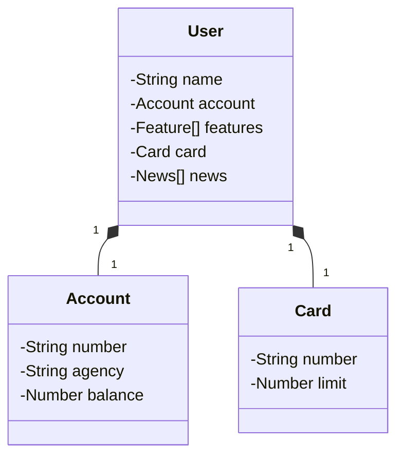

# Published-API

# Published-API

Published-API é uma aplicação desenvolvida em Spring Boot que permite gerenciar usuários, sua conta e cartão. Através de endpoints, é possível realizar operações bancárias, como saque, depósito e transferência, alterando o saldo das contas associadas.

## Funcionalidades

Como é uma API para fins de estudo e portfólio, todas as rotas são abertas à todos que desejarem fazer qualquer tipo de operação CRUD.

- **Criar, Deletar, Atualizar e buscar usuários**: Um usuário possui uma conta e um cartão associados automaticamente ao ser criado.
- **Gerenciar saldo**: Endpoints para saque, depósito e transferência entre contas.
- **Documentação da API**: Swagger disponível para visualização e teste das requisições.

## Tecnologias Utilizadas

- **Java 17**
- **Spring Boot 3.2.0**
- **Lombok**: Simplificação de código com getters, setters, e construtores automáticos.
- **JPA/Hibernate**: Mapeamento objeto-relacional.
- **H2 Database**: Banco de dados em memória para ambiente de desenvolvimento.
- **MySQL**: Utilizado no ambiente de produção (PRD).
- **Swagger**: Documentação e testes da API.

## Como Executar o Projeto Localmente

### Pré-requisitos

- **JDK 17** ou superior
- **Maven** (para gerenciamento de dependências)
- **MySQL** (para ambiente de produção, opcional)

### Passos

1. **Clone o repositório**:
   ```bash
   git clone https://github.com/seu-usuario/Published-API.git
   ```
2. **Navegue até o diretório do projeto**:
   ```bash
   cd Published-API
   ```
3. **Execute a aplicação com Maven: Para o ambiente de desenvolvimento, utilize o banco de dados H2 integrado, caso queira, altere o application-prd.properties para configurar o MySql, pode também usar o banco de sua preferência fazendo as devidas correções**:
   ```bash
   mvn spring-boot:run
   ```
2. **Acesse o Swagger: A documentação da API está disponível no Swagger. Após iniciar a aplicação, acesse:**:
   ```bash
   http://localhost:8080/swagger-ui.html
   ```
   
## Diagrama de classes:

